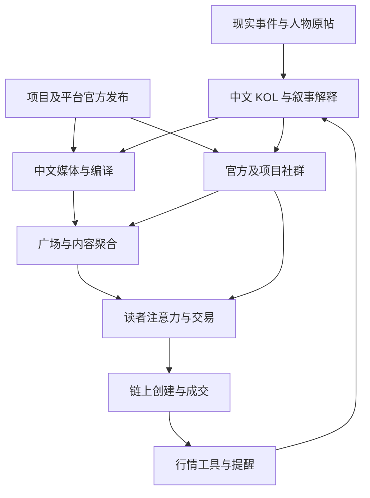

# 中文信息源地图 v1：股票上链、BNB 生态、币安 Alpha、加密右尾

核验日期：2026-10-02（北京时间）。范围：公开网页、公开社交资料、公开 Telegram 预览、机构自述与产品文档。没有进入私人群，也没有取得个人商业合同或后台收入。Alpha 在本报告中特指币安 Alpha；“交易超额收益”另行表述。

本地图回答四个问题：信息由谁产生；中文读者通过谁看到；什么事实可以核验；传播者从什么行为中获利。账号和产品会改名，长期书签优先保存官网及其官方社群目录。

**主要判断：四个主题共用不少传播渠道，但源头不同。股票上链的产品事实大量来自英文发行方及交易平台；BNB 中文叙事还受生态人物与中文社区推动；Alpha 活动信息主要由币安发布；巨大右尾的线索则分散在现实热点、项目原发、链上成交与社区扩散中。媒体、KOL 和交易工具各自承担不同环节。**

速度不是一个固定的网站排名。本次没有做持续到达时间测量；下文的“原发、近源、二次解释、定时归纳”是传播层级判断。“分钟级可能”“小时至日”描述处理方式，不是测得的平均延迟。官方中文、英文和 App 也可能并行发布。新闻有时来自媒体独家采访，届时媒体本身就是源头。

## 1. 四张主题地图

| 主题 | 消息实际从哪里产生 | 中文信息主要从哪里流出 | 应回到哪里核验 | 核心利益关系与误读 |
| --- | --- | --- | --- | --- |
| 股票上链：有底层资产支持的股票代币 | xStocks/Backed、Ondo、币安 bStocks、Robinhood；交易平台与链上集成方 | 平台中文公告/FAQ；吴说、PANews 的股票代币/RWA 内容；Foresight、深潮、链捕手、律动等报道；数据型作者 | 发行方资产目录、法律文件、官方合约地址、公司行动与赎回文档；平台自身产品公告 | 发行方、平台和生态合作方希望扩大产品使用。产品增长、转账量与普通交易者净盈利是不同问题 |
| 股票上链：股票永续、预上市衍生品 | trade[XYZ] 等部署方、Hyperliquid 规则及具体市场配置 | 中文媒体快讯、机制解释、交易社区 | 部署方 docs、具体市场参数、预言机及休市规则；协议文档 | 永续价格敞口和持有股票代币有不同权利、费用及定价机制 |
| 股票上链：股票配对 Meme/新链生态 | 发射器新增计价资产、DEX 新池、生态项目发布；其后形成社区叙事 | 项目 X/Discord/TG → 链上工具与交易者 → 中文 KOL/群 → 媒体解释与公众号 | 发射器支持资产清单、真实计价币合约、池子、首笔成交；项目官网与官方链文档 | 用某只股票代币计价的 Meme，不因此取得该公司的股权或盈利能力。需区分基础资产与投机币 |
| BNB 生态：产品、扶持、活动 | BNB Chain、Four.Meme、PancakeSwap、具体项目方；有时是币安自身活动 | 官方华语公告/TG、项目账号、开发者社区、中文媒体 | BNB 官网社区目录、项目原公告、合约部署、活动规则与实际资金流 | BNB Chain 生态活动、币安 Alpha、币安现货上币是三个不同事件 |
| BNB 生态：中文文化与 Meme | CZ/何一等人物公开发言、中文现实梗、项目/持币社区再创作、真实市场异动 | X 原帖和回复区、项目 TG/微信/QQ 群、中文交易者、币安广场；媒体随后编排 | 最初公开发言、首次出现的合约、可交易市场；每条传播的时间 | “人物说了某句话”与“人物支持某个币”之间经常插入市场解读。点赞、转发、关注也须逐项记录 |
| 币安 Alpha：上新、积分、空投、TGE | 币安钱包官方 X、币安公告/FAQ、App 的 Alpha 活动页 | @BinanceWallet、@binancezh、中文公告 TG；第三方提醒/日历；广场教程、KOL 和群 | 对应活动原公告、活动页、最新 FAQ；有翻译冲突时按公告说明核对英文 | 规则是动态的；日历和教程可能过期。Alpha 标签不能被当成未来现货上市承诺 |
| 币安 Alpha：成本、收益、可持续性 | 参与者记录、研究者看板、交易记录 | 数据型作者、媒体研究、群内账单与教程 | 时间窗、全部成本、实际到账和可卖价值；看板 SQL/口径 | 空投面值、最高点估值、领取时可兑现价值和净利润不同。教程还可能携带注册/交易返佣 |
| 加密右尾：事件与注意力 | 现实热点、品牌/人物原发、项目动作、首次市场出现；也可能由推广活动推动 | X、中文社群、Meme 交易工具、媒体热榜、广场、短视频 | 现实事件原帖/公告、项目合约、原始成交与流动性；传播者首次提及时间 | 内容既可能描述价格上涨，也可能推动后续买入。要区分消息产生、观察到价格、发帖、读者收到四个时点 |

股票产品及配对资产的官方入口见 O06–O13；Alpha 官方发布路径及规则见 S01–S05；Alpha 上架不代表未来现货上市见 S05。

### 传播会形成循环

这是常见路径的分析模型，不能证明任一具体币经历了全部环节。同一条原公告被五家媒体转载，仍然只有一个原始信源；同一篇长文出现在公众号、X、广场和聚合 App，也不增加独立证据。

## 2. 渠道速度、质量与利益关系

| 渠道 | 速度怎样理解 | 最有用的信息 | 常见质量问题 | 公开或可能的收益来源 | 适合承担的任务 |
| --- | --- | --- | --- | --- | --- |
| 官方公告、App 活动页、正式 docs | 对自身规则是原发或最终核验入口；各表面之间谁先发布未测 | 产品上线、资格、时间、规则、合约、市场参数 | 宣传语与精确条款不同；旧页仍能被搜索到；页面可能修改 | 产品采用、交易活动、生态增长；具体收费依产品而定 | 冻结事实和规则 |
| 项目/生态官方 X、官方 TG 公告 | 靠近源头；往往先发简讯再补文档；不承诺固定延迟 | 新功能、活动预告、地址与故障说明 | 营销选择性、承诺与实现混在一起 | 项目或生态自身商业利益 | 捕捉“发生了什么”，再查实现 |
| X 中文 KOL、回复区与 Space | 可能原发，也可能是第一轮转述；现场讨论可能更早但难审计 | 叙事形成、行业解释、数据观察、候选项目 | 主观判断、选取案例、删改、截图缺时间；Space 摘要可能损失限定条件 | 合作稿、代币/额度、自有仓位、顾问身份、返佣、内容收入、订阅；须逐人逐帖核实 | 发现线索与观察传播 |
| 官方/项目 Telegram 讨论群 | 可与官方发布并行；“群里先看到”也可能是机器人转载 | 社区问题、规则争议、项目回应、参与者反馈 | 非管理员内容并非官方承诺；大量重复及利益相关成员 | 项目活动、社群增长；群内个别人员可能推广 | 核验实际使用问题与社区结构 |
| 交易群、钱包提醒、合约查询 Bot | 自动化处理可能很快；真正延迟包括上游索引、推送、手机到达 | 首次出现、新池、交易异动、具体合约 | 钱包标签并非身份真相；重复钱包、短窗口与筛选偏差 | 群费、工具交易返佣、持仓、项目合作；GMGN 群 Bot 返佣机制已核实 | 产生可追溯的候选记录 |
| 中文媒体快讯/App 推送 | 原公告与 X 转述常处于早期传播；准确核验可能增加延迟 | 多主题扫描、原链接、事件时间线 | 多家共用信源；“据社区消息”被包装为确定事实；价格异动后报道 | 商业服务、赞助、广告、订阅等，机构差异大 | 降低漏看；去重与回溯 |
| 中文媒体深度、研究、访谈 | 一般需要更长处理时间；独家访谈又可能创造新信息 | 机制、生态结构、数据方法、争论双方 | 翻译变形、标题夸大、推广与研究边界、方法不透明 | 部分机构明确提供内容/营销合作；是否每篇收费无法推断 | 理解机制，找原研究和数据 |
| 微信公众号 | 长文、精选、定时推送常见；原创爆料也可成为第一源头 | 结构化解释、访谈、行业关系、中文现实叙事 | 很难全量检索；旧稿更新不醒目；改名迁移；运营主体需确认 | 广告、商务合作、私域服务、订阅/课程、返佣等；逐号核实 | 研究与复盘，保留原作者 |
| 微信/QQ 私域群 | 可能先于公开发布，也可能只是重复搬运；本次无法验证速度 | 本地社区、实际参与经验、人际关系 | 缺可审计历史、筛选进入条件、无法评估未命中的帖子 | 会员费、推荐佣金、项目合作、自有仓位等；本轮具体群未核实 | 后续有明确研究问题时定向加入 |
| 币安广场 | 官方账号可发布原消息；用户流和推荐流混合，推荐出现时间不能当原发时间 | 币安产品信息、中文参与经验、教程、情绪扩散 | 官方公告、官方聚合新闻、用户观点需要拆开；截图和 AI 编译易失真 | Write to Earn 可按读者后续合格交易拿手续费佣金；活动奖励及其他合作需另核实 | 官方事实入口之一；观察分发与交易动机 |
| Followin 等聚合平台 | 速度由上游与抓取处理决定；“先在这里看到”不表示这里原发 | 跨语种、跨平台集中检索、作者召回 | 自动翻译、转发归因、排序、旧内容重新分发 | 本轮具体商业/奖励规则未全面核实 | 扩大召回，再回原文 |
| DEX 热榜与行情页面 | 接近市场状态；仍受索引、缓存、筛选影响 | 新池、流动性、成交、注意力集中位置 | 热度不等于自然需求；不同工具统计口径不同 | 工具交易费、广告及付费曝光；DEX Screener Boost 已核实 | 观察市场及推广活动，不直接推断净收益 |
| 微博、抖音、B站、知乎及品牌公众号 | 对某些中文文化事件，它们可能比加密社群更上游 | 新梗、人物/品牌事件、用户再创作 | 榜单热度、真实事件与情绪解释不同；进入币圈后的版本会变形 | 内容与品牌营销等；具体事件的付费情况另查 | 识别现实事件进入加密市场的桥梁 |

“可能存在”不等于“已经发生”。没有找到推广披露，不足以认定没有商业关系；有广告业务，也不足以认定某条事实错误。

## 3. 官方与近源入口目录

H：本次取得官网链接、官方文档或平台认证账号等直接证据。M：取得公开自述/可识别账号，但部分交叉认证、最新状态或正文读取有缺口。级别说明入口身份及证据完整度，不代表交易能力。

| ID | 入口与直接链接 | 主题/语言 | 要看什么 | 速度、质量与利益 | 核验状态 |
| --- | --- | --- | --- | --- | --- |
| O01 | [币安中文公告](https://www.binance.com/zh-CN/support/announcement)、[官方社区目录](https://www.binance.com/zh-CN/community) | BNB/Alpha/bStocks；中文 | 每次活动、上新、规则变更、公告修订 | 自身规则近源；平台商业立场明确；具体活动优先于旧教程 | H，社区目录已打开 |
| O02 | [币安钱包 X @BinanceWallet](https://x.com/BinanceWallet) | Alpha/钱包/生态；双语内容 | 活动首发、项目及门槛、时间、补充公告 | 官方近源；不要只读媒体截取的半段 | H，币安 2026-02-10 公告明确将具体活动信息导向该官方 X |
| O03 | [币安华语 X @binancezh](https://x.com/binancezh)、[币安中文社区认证广场账号](https://www.binance.com/zh-CN/square/profile/binancecn) | 币安生态；中文 | 中文同步、社区活动、产品解读 | 中文官方声音；社区问答和正式条款各有用途 | H，官方社区及认证广场资料交叉支持 |
| O04 | [BNB Chain 官网社区中心](https://www.bnbchain.org/zh-CN/community)、[中文公告 TG](https://t.me/BNBChainZH_ANN)、[华语讨论群](https://t.me/BNBChainZH) | BNB；中文/英文 | 扶持、技术/产品动作、活动、生态入口 | 公告近源；讨论群的信息要核对发言身份。生态宣传立场明确 | H，官网直接链接到中文公告，公告资料回链讨论群 |
| O05 | [Four.Meme 官网](https://four.meme/)、[官方文档](https://four-meme.gitbook.io/four.meme)、[文档链接的 TG 群](https://t.me/four_meme) | BNB Meme；多语 | 发射机制、费用/模式变化、活动、实际新币 | 项目自身近源，所有平台币不因在此发行而得到背书 | H/M：文档及 TG 回链取得；部分前端需要动态加载。@four_meme_channel 可见公开预览，但本次未取得完整双向认证，作补充入口 |
| O06 | [PancakeSwap 官方博客](https://blog.pancakeswap.finance/) | BNB/DEX/活动；可选简繁中文 | 新功能、资产、交易活动、流动性激励 | 产品原发；交易比赛与奖励信息包含促进交易的动机 | H，博客有中文语言入口 |
| O07 | [xStocks 官网](https://xstocks.com/)、[News](https://xstocks.com/news)、[Docs](https://docs.xstocks.fi/docs)、[X @xStocksFi](https://x.com/xStocksFi)、[TG](https://t.me/xStocksFi) | 股票代币；主要英文 | 发行资产、集成、公司行动、合约与技术信息 | 产品事实原发；合作发布有扩展采用动机 | H，官网直接链接 X/TG/docs |
| O08 | [Kraken 中文 xStocks FAQ](https://support.kraken.com/cn/articles/xstocks-faq)、[中文产品页](https://www.kraken.com/cn/xstocks) | 股票代币；中文 | Kraken 自身的产品、托管/使用说明、相关法律入口 | 中文官方核验层；该平台规则需与链上或其他平台规则分别核对 | H |
| O09 | [Bybit 繁中 xStocks FAQ](https://www.bybit.com/zh-TW/help-center/article/FAQ-xStocks-on-Bybit) | 股票代币；繁中 | Bybit 自身的支持资产和使用机制 | 中文官方核验层；具有产品采用立场 | H |
| O10 | [币安 bStocks 公告](https://www.binance.com/zh-CN/support/announcement/detail/2c0c92ed15ac42d1b14bb1eac00d22bb)、[FAQ](https://www.binance.com/zh-CN/support/faq/detail/f0c03cd6509a4085b4cce1636f16be38) | 股票代币/BNB；中文 | 产品身份、发行方、资产支持、使用规则、证明入口 | 原发和规则核验；不能套用 xStocks 的合约或赎回规则 | H，公告日期 2026-06-11 |
| O11 | [Ondo 官方博客](https://ondo.finance/blog)、[股票产品](https://ondo.finance/ondo-stocks)、[Docs](https://docs.ondo.finance/) | Ondo Global Markets/Ondo Stocks；主要英文 | 产品命名与范围、支持链、资产、规则及 API 文档 | 产品原发；中文报道是桥梁，长期事实以官方文档核对 | H，产品页当前使用 Ondo Stocks 名称 |
| O12 | [Robinhood 新闻中心 Crypto](https://robinhood.com/us/en/newsroom/category/crypto/)、[Chain 文档](https://docs.robinhood.com/chain/) | 股票代币/新链；主要英文 | 主网、产品及生态基础设施；实际网络与官方参数 | 原发；“官方链存在”与“链上任一项目被官方认可”需分别取证 | H，官网公告与官方 docs 已找到；部分主页面正文不可提取 |
| O13 | [trade[XYZ] 文档](https://docs.trade.xyz/)、[X @tradexyz](https://x.com/tradexyz) | 股票永续/预上市产品；主要英文 | 具体市场、定价和休市规则、风险参数、变化 | 部署方规则原发；中文帖子中的机制摘要必须对照具体市场文档 | H：docs 已打开；X 部分读取受限 |
| O14 | [Pump 自定义计价资产清单](https://pump.fun/docs/custom-pairs) | 股票配对 Meme/右尾；英文 | 实际支持的计价资产、发行方、准确合约 | 机制/资产事实近源；用于排除同名币和概念偷换 | H，官方清单已打开 |
| O15 | [CZ X @cz_binance](https://x.com/cz_binance)、[何一 X @heyibinance](https://x.com/heyibinance) | BNB/币安文化；中英文 | 原始发言、回复、时间及确切对象 | 对自己的公开表达是源头；具有生态关联。市场附会须独立标记 | M/H：账号身份可识别，部分帖子已检索；本轮没有全面读取历史或测传播延迟 |

**股票上链的检索词要拆开**：tokenized stocks / 股票代币；xStocks / bStocks / Ondo Stocks；stock perpetuals / HIP-3 / 股票永续；custom pairs / quote asset / 币股配对；Robinhood Chain / 具体生态项目名。单搜“RWA”会混入大量稳定币、债券与地产信息。

**Alpha 的官方 FAQ 是活文档。**本次读到的积分 FAQ 显示于 2026-07-10 更新；它明确指出旧 BSC Alpha 限价单规则已停止适用。不能将搜索结果里的旧教程直接当当前规则。[S04]

## 4. 八家中文媒体：用处和商业证据分别记录

下面是基于本次公开样本的用途判断，不是全量准确率、速度或荐币收益排名。“官网商务入口”与“明确销售营销服务”证据强度不同。

| ID/入口 | 最适合看什么 | 对四主题的用途判断 | 速度理解 | 商业关系：本轮核实到什么 | 没有核实到什么 |
| --- | --- | --- | --- | --- | --- |
| M01 [吴说](https://www.wublock123.com/)，[TG @wublock](https://t.me/wublock)，中文 X @wublockchain12 | 交易平台、行业事实、监管/公司消息、采访与数据作者 | 股票代币事实、平台动作；BNB/Alpha 数据与新闻可作交叉观察 | 快讯/原发采访与深度分别看；不声称绝对最快 | [新闻准则](https://www.wublock123.com/news-guidelines)于 2025-12 更新，公开承诺编辑与业务隔离、事实错误勘误、不得借报道或内幕获利；另有合作联系入口 | 准则实际执行的独立审计、每篇稿件商业关系、具体广告费；不能据“独立”二字推断所有商业关系不存在 |
| M02 [律动 BlockBeats](https://www.theblockbeats.info/)，[TG @theblockbeats](https://t.me/theblockbeats) | 市场快讯、链上热门事件、机制编译、研究及访谈 | 用作市场与右尾话题扫描；股票/RWA 与 BNB 事件回溯 | 快讯与长文分开；媒体宣传“更早”未在本次计时验证 | [关于我们](https://tw.theblockbeats.news/news/5616)列出 BD 商务入口、合作分发平台和官方社群；公开存在关于 fomo 报道的[更正说明](https://www.theblockbeats.info/news/63796)检索记录 | 商务合作是否对应某篇收费稿、最新完整收费/隔离政策；更正正文部分访问受限。一次更正不能用于推断全站错误率 |
| M03 [PANews](https://www.panewslab.com/zh)，[TG @PANewsCN](https://t.me/PANewsCN) | RWA 周刊、数据文章、项目/生态扫描、专栏和快讯 | 股票上链的中文覆盖入口；兼顾 Meme、BNB、Alpha 与研究作者召回 | 快讯、日报/周刊、原创与入驻专栏是不同产品 | [PANONY 官网](https://www.panony.com/)说明 PANews 的关联，并列出战略咨询、品牌/市场拓展服务；PANews 有[商务合作专栏](https://www.panewslab.com/zh/columns/87) | 单篇文章的报酬、完整编辑隔离执行、作者持仓。其[入驻 FAQ](https://www.panewslab.com/zh/articles/1648715827320015)反对宣传软文，不能因此否定机构其他商业服务的存在 |
| M04 [深潮 TechFlow](https://www.techflowpost.com/)，[X @TechFlowPost](https://x.com/TechFlowPost)，[TG @TechFlowDaily](https://t.me/TechFlowDaily) | 新叙事、机制解释、研究编译、数据情报与访谈 | 股票配对 Meme、生态变化和右尾机制的线索入口 | 原发/编译/长文分开；处理深度和抢首发是不同功能 | 2026-08-07 [机构介绍](https://www.techflowpost.com/article/33082)自述参与早期 Alpha 项目内容合作，并与生态伙伴共创研究；[联系页](https://www.techflowpost.com/article/9425)有商务入口 | 单篇是否收费、合作金额、作者/机构具体仓位。机构自述的流量及高质量比例未独立验证 |
| M05 [Foresight News](https://foresightnews.pro/)，[TG @foresightnews](https://t.me/foresightnews) | 日历、事件线、研究、编译、作者专栏 | Alpha 规则迭代及股票上链机制；用日历补漏 | 快讯与计划发布的解读分开 | [BUIDL 2025](https://foresightnews.pro/buidl2025)官方页面列出商业合作、赞助和与 Foresight Ventures/The Block 的共同主办关系 | 不能用会议共同主办直接推断公司所有权；文章收费、编辑隔离和与具体被投项目的关系未全面核实 |
| M06 [链捕手 ChainCatcher](https://www.chaincatcher.com/) | 项目/机构研究、融资、行业解释、数据工具 | 股票生态组织结构、BNB 项目背景、研究回溯 | 快讯与深访分开；“首发”需查对应事件 | [商务页](https://www.chaincatcher.com/pages/business)明确提供品牌营销、快讯、深度内容与全渠道宣发；[机构介绍](https://www.chaincatcher.com/pages/about)说明与 RootData 的合作 | 某篇具体付费与否、客户名单与编辑工作如何隔离；搜索权重/AI 流量自述不等于准确率证据 |
| M07 [Odaily 星球日报](https://www.odaily.news/zh-CN) | 快讯、市场故事、生态研究、参与者经验 | BNB/Meme/Alpha 的事件和参与成本线索；兼顾股票上链 | 快讯与研究分别看；晒单或赚钱故事要补完整成本 | [关于我们](https://www.odaily.news/zh-CN/about)明确提供整合营销；[招聘页](https://www.odaily.news/zh-CN/about/join)列有媒体服务销售职责 | 每篇收费状态、受访者利益和完整交易记录 |
| M08 [动区 BlockTempo](https://www.blocktempo.com/) | 繁中全球新闻、台湾社区、采访和行业解释 | 补充不同中文受众中的传播与股票/BNB 热点 | 主要按文章、现场采访、社群分发区分；延迟未测 | [机构介绍](https://www.blocktempo.com/about-blocktempo/)说明社群和 Asia Blockchain Summit 组织角色，提供合作联系；另有官方订阅合作报道 | 合作联系本身不足以证明收取项目软文费；本轮未取得推广报价、单篇合同或完整隔离政策 |

### 股票底层资产的中文资讯：另保留四个入口

股票上链有两股不同的信息流：发行方及链上产品发布；上市公司与股票市场自身的消息。后者先从上市公司 IR、正式财报、交易所/监管原公告核验，再用以下中文入口理解和补漏。对某些事件，公司原公告或英文通讯社比中文译报更上游。

| ID/入口 | 主要用途 | 速度与质量 | 已确认的商业关系/未知项 |
| --- | --- | --- | --- |
| M09 [财联社](https://www.cls.cn/)，电报/美股栏目 | 财报、宏观、上市公司与市场事件提醒 | 官网提供电报和深度，自述 7×24 服务；本轮未测译报延迟。不是所有电报都原创 | 官网有 VIP/投研产品入口；具体新闻合作费及完整编辑隔离政策未核实。[S46] |
| M10 [华尔街见闻](https://wallstreetcn.com/) | 全球宏观、美股与科技公司的中文解释 | 快讯与深度分开看；新闻与分析判断分开。本轮不评价预测能力 | [会员帮助](https://wallstreetcn.com/member/help)证实付费会员和课程；单篇赞助情况未核实。这里的“Alpha 会员”不是币安 Alpha。[S47] |
| M11 [富途资讯](https://news.futunn.com/) | 个股新闻、财报、公司事件、中文讨论的入口 | 综合资讯与社区观点分别识别；网页正文部分动态加载，当前完整分发及延迟未测 | 富途官方介绍同时包含资讯/社区与集团券商交易服务；存在经纪业务关联。不能据此认定某条新闻偏向某只股票。[S48] |
| M12 [雪球](https://xueqiu.com/) | 中文个股研究、投资者争论、持仓叙事 | 用户内容不等于编辑部核验；寻找原财报、估值假设及反方观点。不是稳定的活动抢首发入口 | 官网索引列广告合作、金融机构营销及产品服务；用户逐篇持仓/报酬未核实。部分官网正文读取受限。[S49] |

这些入口用来解释底层公司及市场，不替代股票代币的合约、赎回、预言机或周末规则。普通股票的增长叙事也不能自动延伸到以它计价的 Meme。

阅读任何媒体都先识别四个字段：**作者、编译者、原始来源、商业/合作标识**。站点上存在一篇文章，只能证明它被该站发布；PANews/Foresight 等入驻专栏与编辑部原创，须按实际署名区分。

## 5. 中文 KOL/作者：作为线索节点，不以名气替代证据

这张表确认入口和公开身份/内容样本。没有审计这些人的完整业绩，也没有依据“别人说他接广告”给任何人贴推广标签。

| ID/入口 | 本次可确认的内容方向 | 速度与质量怎样用 | 已知关联/利益线索 | 付费推广状态与限制 |
| --- | --- | --- | --- | --- |
| K01 [DeFiOasis @defioasis](https://x.com/defioasis) | 自述研究者/投资者，关注链上数据、Meme、CEX 接入链上、预测市场；公开内容涉及 Alpha 和股票配对生态 | 数据线索及统计口径入口；能给出看板/地址时可回溯。统计发现可能晚于原始交易 | 自述 Investor；公开发布于媒体和广场；这些身份不说明某篇收费 | 项目合作报酬、仓位与完整业绩未核实。广场有佣金制度，不等于已核实本人领取 |
| K02 [Ai 姨 @ai_9684xtpa](https://x.com/ai_9684xtpa) | 地址/资金流观察、BSC Meme/发射器数据；本次取得 2026-02-05 数据讨论原帖 | 适合用具体地址、时间、数据源检查事件；将原始记录和“为什么这样做”的解释分开 | 公开帖子与 Dune/DeFiLlama/地址分析链接相关 | 项目推广费、持仓、返佣关系未核实；不凭赞美或批评某项目判断收钱 |
| K03 [余烬 @EmberCN](https://x.com/EmberCN)，[本人广场资料](https://www.binance.com/zh-CN/square/profile/ember) | 公开资料与内容以地址交易、持仓和资金流分析为主 | 地址级事实可以复查；媒体在其观察之后转载又多一层。交易所转入不自动等于已经卖出 | 广场资料明确回链该 X；镜像资料有其他商业线索，但本报告未把镜像当完整一手商业证据 | 是否收项目推广费、具体推广/返佣收入未核实；X 直接读取部分受限 |
| K04 [0xSun @0xSunNFT](https://x.com/0xSunNFT) | 交易者的公开观点、Meme/新资产发现；账户自述强调钱包记录 | 看首次观点、当时可交易市场和完整后续；单个成功案例不代表可复制能力 | 有交易者/投资者自身利益；每次具体仓位须从其披露或可靠归因另核 | 广告报酬与完整多钱包净收益未核实；本次未做钱包归因审计 |
| K05 [Haotian/郝天 @tmel0211](https://x.com/tmel0211)，[订阅专栏](https://haotiancryptoinsight.substack.com/) | 技术、产业与叙事解释；公开资料包含美股代币化等方向 | 更适合提出机制问题与找技术线索；长文不宜用作秒级事件信号 | 公开资料自述 Amber Group Advisor、接受合作联系；是自述关联，未审计雇佣/报酬关系 | 接受合作联系不等于任一具体推文收费；合作金额与逐帖披露未核实 |
| K06 [陈剑 Jason @jason_chen998](https://x.com/jason_chen998) | 项目机制、行业热点、公开市场评论；本次检索到 2026-09/10 原帖 | 用来获取解释与反方观点；明确区分事实、推断和预测 | 自有投资及商业关系需按帖子披露核对；本轮未建立完整关系表 | 推广报酬与完整仓位未核实；本报告不以情绪化表达判定准确率 |
| K07 [Dovey Wan/万卉 @DoveyWan](https://x.com/DoveyWan)，[Primitive](https://primitive.ventures/) | 机构/产业与投资叙事观察 | 原发观点的速度依事件；投资框架适合找机制，不能直接代替净收益验证 | Primitive 官网索引资料列其为 Founder，存在可明确识别的投资机构关联 | 特定项目是否在其组合、顾问报酬及具体推广费用，需逐项查证；官网部分页面正文提取受限 |
| K08 [大宇 @BTCdayu](https://x.com/BTCdayu)，公众号检索词“宇十一” | 本次取得 2026-05-22 自发 X 原帖，明确提到该公众号首发 AI/美股研究 | 适合补充传统股票成长叙事与中文传播；这与股票代币机制研究是不同用途 | 研究/投资者立场；其商业链接的镜像信息不足以据此确认本轮具体报酬 | 项目推广费和完整仓位未核实。搜索中出现多个高度相似账号，入口只采用此处原帖对应账号 |

样本证据：[S26–S33]。本表的“未核实”不是否定，更不是“没有”。后续可以增补 BNB 专属人物、地方社区组织者与交易者；本次一手身份或当前状态不能确认的账号，没有进入核心订阅名单。

**看 KOL 的最有价值字段是“第一次留下什么可核验的信息”。**例如：具体合约、原公告、明确机制、带 SQL 的看板、可复算的时间窗。只给涨幅截图、情绪断言或删除失败记录的内容，证据价值较低。这个判断适用于单条内容，不给人设定永久等级。

## 6. Telegram、公众号与私域怎么落到实际入口

### 6.1 可从公开入口开始的 Telegram

| 入口 | 类型 | 主题与用途 | 信息质量/利益提示 |
| --- | --- | --- | --- |
| [@binance_cn](https://t.me/binance_cn) | 币安中文公告 | Alpha/上新/活动规则的提醒 | 官网社区目录直接链接；读对应完整公告 |
| [@BinanceChinese](https://t.me/BinanceChinese) | 币安中文讨论群 | 产品使用、中文社区、活动问答 | 官网直接链接；群员发言须与管理员/公告区分 |
| [@BNBChainZH_ANN](https://t.me/BNBChainZH_ANN) | BNB 中文公告 | BNB 产品、技术与生态活动 | 官网社区中心直接链接 |
| [@BNBChainZH](https://t.me/BNBChainZH) | BNB 华语讨论 | 社区问题、项目入口、活动 | 公告资料回链；具体发言利益关系另查 |
| [@four_meme](https://t.me/four_meme) | Four.Meme 群 | 机制变化、项目社区及使用反馈 | 官方文档有该链接；群内币不等于平台背书 |
| [@theblockbeats](https://t.me/theblockbeats) | 律动订阅 | 快讯与编辑内容 | 机构官网提供；与 [BlockBeats_App 讨论群](https://t.me/BlockBeats_App)分开 |
| [@TechFlowDaily](https://t.me/TechFlowDaily) | 深潮订阅 | 研究、编译与热点 | 官网自述的官方入口；查看署名与原来源 |
| [@PANewsCN](https://t.me/PANewsCN) | PANews 资讯 | 股票/RWA、行业与链上事件 | 机构文章回链；原创与专栏要区分 |
| [@foresightnews](https://t.me/foresightnews) | Foresight 资讯 | 快讯、事件线、日历/长文 | 公开频道可见；具体推送是原发还是转载需回原文 |
| [@wublock](https://t.me/wublock) | 吴说中文资讯 | 行业事实、采访、地址数据 | 频道明确自述为唯一中文官方频道；结合官网和新闻准则核验 |
| [@xStocksFi](https://t.me/xStocksFi) | xStocks 官方 | 股票代币产品变化 | 英文近源桥梁；官网直接链接 |
| GMGN 合约/钱包提醒 Bot | 工具，而非统一的新闻编辑部 | 交易异动与候选出现 | 从[官方中文 docs](https://docs.gmgn.ai/cn)进入；Bot 可能绑定群主返佣码。[S14–S15] |

公开预览通常不能证明所有历史推送都完整保存，也不能证明私人讨论早于公开源。把“看到一条消息”的时间与消息原发布时间分别记下。

### 6.2 微信公众号与中文研究社区

这里列的是搜索词和核验入口；本次没有在微信中逐个扫描主体认证页、二维码和完整历史。公众号名字可能变化，确认主体后再订阅。

| 搜索词/研究入口 | 公开号的主要用途 | 核验办法 | 速度与商业证据 |
| --- | --- | --- | --- |
| 吴说 / 吴说区块链 | 行业事实、独家采访、精选深度 | 用[官网 App/社交页](https://www.wublock123.com/html/app/)的公众号二维码，避免仅按名字选号 | 官网有公众号入口；准则可查，收费状态逐篇核实 |
| 深潮 TechFlow | 叙事、机制、编译与研究 | 从[官网机构介绍](https://www.techflowpost.com/article/33082)及当前站点社交入口进入 | 官网自述以公众号起步、开展内容合作；当前单篇费用未核实 |
| PANews | RWA/股票、数据、周刊与生态扫描 | 官网/出版者 App 资料与公众号主体交叉确认 | 出版者 App 资料明确列公众号 PANews；本次未扫描微信主体 |
| 律动 BlockBeats / Foresight News / 链捕手 / Odaily | 编辑长文、采访、日报、专题 | 对照对应机构官网社交入口及署名，必要时先通过官网阅读同文 | 不因名称相似认定官方；当前公众号的完整运营/商务细则未核实 |
| 宇十一 | AI/美股成长叙事、个人长文 | [@BTCdayu 原帖](https://x.com/BTCdayu/status/2057935771924058532)提及；再核公众号主体 | 可作为传统股票叙事补充；不直接据此推断股票代币或 Meme 可盈利 |
| [Biteye @BiteyeCN](https://x.com/BiteyeCN) | 社区研究、工具/参与方式、创作者与中文内容生态观察 | 从其公开原帖回到研究全文及当前公众号链接；名字/迁移状态本轮未完整确认 | 有公开内容平台收益实测自述；属于自述实验，未独立复算；具体项目推广报酬未核实 |
| [BuidlerDAO 官方入口](https://link3.to/buidlerdao) | 研究社区、项目网络、开发/行业活动 | 按组织入口核对作者和活动主办方 | 本次找到其自发活动资料与商务联系方式；研究、会员/活动、推广关系要分别记录 |

微信/QQ 私域群没有公开完整材料，无法做可信的横向速度或收费排名。本地图没有把“收费群更接近源头”“免费群更中立”当成事实。若要判断某个群，至少取得：群主身份、收费/返佣说明、能连续回溯的消息、原链接，以及包含失败案例的完整样本。

### 6.3 中文现实热点的更上游

围绕中文人物、电影、品牌、AI 产品或公共梗形成的 Meme，额外保留：

- 人物/品牌本人的微博、抖音、公众号、B站发布；优先原发布者而不是热搜截图。
- 微博话题、短视频再创作、B站社区、知乎讨论：用来理解注意力如何扩散，不能把平台榜单当真实独立用户数。
- 第一个把现实事件和可交易合约连接起来的公开帖子。它比后来的“热点总结”更能说明传播桥梁。

需要三个时点：现实事件公开、币/池首次可交易、中文加密圈首次关联。三者可能相隔很长；币也可能早已存在，只在热点发生后换叙事。

## 7. 工具、聚合器和数据源

| ID/入口 | 能帮助看见什么 | 数据与速度限制 | 利益关系及使用建议 |
| --- | --- | --- | --- |
| T01 [GMGN](https://gmgn.ai/)，[中文文档](https://docs.gmgn.ai/cn) | 新币、新池、成交、钱包及合约线索 | 标签、第三方数据、索引和提醒不能当零延迟保证；官方中文说明提示准确性与时效性有限 | 有交易费及推荐佣金。尤其群 Bot 消息可能配置群主返佣；拆开数据字段和促成交易的链接 |
| T02 [DEX Screener](https://dexscreener.com/)，[Trending 文档](https://docs.dexscreener.com/trending)，[Boosting](https://docs.dexscreener.com/boosting) | 市场、池子、成交、热度、付费曝光 | Trending Score 的定义不同于自然讨论人数；未测到达延迟 | 官方明确付费 Boost 能提高曝光与 Trending Score。记录 Boost/广告状态，不据热榜位置直接判断真实需求 |
| T03 [BscScan](https://bscscan.com/) / [Solscan](https://solscan.io/) / 官方链浏览器 | 合约、交易、地址、池子与部署记录的回溯 | 原始记录与展示标签需分开；归因需验证；时间戳通常不是你收到信息的时间 | 查询事实的工具；搜索热度和广告位不影响原始交易是否发生，但可能影响你先看到谁 |
| T04 [RWA.xyz 股票页](https://app.rwa.xyz/stocks) | 发行方/资产/链的覆盖、股票代币数量与转账统计 | 指标需按方法解释；Transfer Volume 不能直接当二级交易额或交易利润；并非所有指标都实时 | 数据服务商，本轮未审计其完整客户/收费利益。作为母体发现与口径对照，关键数字回方法/合约核实 |
| T05 [Followin](https://followin.io/)，[产品介绍](https://followin.io/zh-Hans/feed/5814395)，[中文 TG](https://t.me/followin_zh) | 从媒体、X、长文、社群及多语种内容集中召回 | 机翻、抓取与排序可能改变语气和先后；聚合到达时间不是原消息产生时间 | 具体商业合作及最新奖励规则本轮未全面核实；保留原作者与原链接后使用 |
| T06 [RootData](https://www.rootdata.com/) | 项目、机构、融资及生态关系线索 | 元数据与实体归属仍需原公告核对；“收录/热度”与投资质量不同 | 链捕手公开说明与其深度合作；本轮未审计具体付费展示政策。适合查关系，再回融资双方原公告 |

英文数据源在这张中文地图中承担“核验桥梁”：能避免中文信息圈把同一条叙事重复引用，也能帮助发现中文覆盖之外的生态。

## 8. 已确认的商业机制，以及仍然未知的部分

| 关系 | 本轮公开证据 | 能得出的结论 | 不能得出的结论 |
| --- | --- | --- | --- |
| 广场内容 → 读者交易 → 创作者佣金 | 币安 Write to Earn FAQ：2026-02-09 更新，公开写明最高 50% 合格交易手续费佣金；当前网页核验于 2026-10-02。[S01] | 内容可能通过读者交易变现；“没收项目软文费”不排除这种交易动机 | 每个创作者都实际收到佣金；某条帖子虚假；对所有活动均适用同一比例 |
| TG 合约查询/钱包提醒 → 群主返佣 | GMGN 官方中文文档说明 KOL 可使用邀请链接，群 Bot 可配置返佣码。[S14–S15] | 数据提醒和交易入口可共享一条商业链；群主收入可能跟交易量相关 | 任何某个群都已绑定返佣；所有钱包提醒都是操纵 |
| 热榜曝光 → 付费推广 | DEX Screener Boosting 与 Trending 官方文档。[S16–S17] | 热榜中存在可购买的曝光推动；需要标记付费 Boost 状态 | 全部热榜由付费决定；付费币必然不赚钱；未付费币不存在其他推广 |
| 中文媒体 → 项目营销服务 | 链捕手商务页；Odaily 关于/招聘页；PANONY 服务与 PANews 关联；深潮内容合作自述。[S07–S12] | 部分中文资讯机构明确有营销/内容合作商业模式；利益关系应在阅读时纳入 | 所有机构模式相同；每篇稿收费；知道某个作者具体收了多少 |
| 投资人/顾问 → 项目观点 | 公开账号自述及 Primitive 官网资料。[S30–S32] | 机构投资或顾问身份是明确需要标注的关联类型 | 其每个观点都服务于持仓；具体代币、金额或合同已经查清 |
| 内容阅读/互动 → 平台收入、个人品牌 | Biteye 有创作者收益实测自述；不同平台具体最新制度本轮未全审计。[S34] | 创作者可能优化曝光、互动或交易反馈，收入可来自内容而非交易成功 | 该自述的数值可普遍复制；本文已经核验所有平台门槛和分成政策 |
| 自有持仓、项目代币/白名单、私人推广合同 | 本次只能逐条查公开披露；私人合同不可见 | “未核实”必须保留，不能把身份、赞美和传言当支付证据 | 没有 #ad 就没有利益冲突；说自己不接广告就没有持仓/返佣/顾问关系 |

内容出现合作关系，仍可包含正确的产品事实或可复算数据。应降低的是未经验证的收益与价值判断的权重，具体事实则按原证据核验。

## 9. 三个具体例子：怎样检查来源与质量

### 例 A：Alpha 新规则从哪里流出来

[币安 2026-02-10 公告](https://www.binance.com/zh-CN/support/announcement/detail/ce482ccb58654041b38df8f176f9b68d)介绍 Alpha Box，并将具体活动代币及门槛导向官方钱包 X；[Foresight 2026-02-11 10:01 文章](https://foresightnews.pro/article/detail/94793)解释机制迭代。这个例子区分了规则发布与翌日解释，不能由此推算该媒体所有快讯的延迟。

实际使用：原公告与 App 决定活动规则，研究文解释参与者行为。第三方日历负责提醒，资格以具体活动核验。不要把旧版积分玩法复制为当前规则。[S02–S04、S35]

### 例 B：同一篇研究如何流经多家媒体

[PANews 发布的“上线 30 天，币安股票业务搞得如何？”](https://www.panewslab.com/zh/articles/019f3f7c-9683-73fa-b14f-e4b477538102)署名显示为 Zhou、ChainCatcher。PANews 的发布页面和 ChainCatcher 的原研究不是两个独立验证。

实际使用：保留作者与原始来源，往原研究的数据口径追一层。不要把转载站点数当证据数。[S36]

### 例 C：标题和时间定义可能矛盾

[深潮 2026-09-14 的币股配对编译](https://www.techflowpost.com/article/33966)署名为 Bitquery Research、深潮编译。标题写“发币前 10 秒”，导读却表述为“首笔交易后的前 10 秒”。仅这个差异就足以要求回查原研究的时间定义。

实际使用：把这种文章作为研究与数据路径线索；本地图没有独立复算其盈利比例或收益率。尤其要检查：币龄从铸币还是首笔交易起算，采样窗口、钱包实体、资金流、未卖持仓估值、交易费、是否含创建者/关联钱包、各平台是否可比。[S37]

**跨时区的另一个问题**：美国/UTC 9 月 9 日与北京时间 9 月 10 日可能对应同一时段。不能把两篇网页“跨日”直接当 24 小时新闻延迟。

## 10. 对你的右尾研究，先保留哪一组入口

建议把地图用于“事件与机制发现”，并同时记录后续能否兑现。覆盖更多消息，不会自动增加净交易优势；这件事要由可观察信息和成本后的结果分别回答。

### 初始 12 个入口

下面是依据覆盖互补性给出的工作组合，并非已验证的收益最佳名单。

| 用途 | 入口 | 为何放进首组 |
| --- | --- | --- |
| Alpha 原发 | @BinanceWallet | 官方活动信息的发布路径 |
| 币安规则提醒 | @binance_cn | 方便回到具体中文公告 |
| BNB 原发 | @BNBChainZH_ANN | 官方生态与产品动作 |
| BNB 发射器 | Four.Meme 官网/docs/TG 官方链路 | 拿到发射机制及变化；按官网当前链接选择通知表面 |
| 股票代币源头 | xStocks News/官方 X | 发行、集成与资产变化 |
| 股票代币另一母体 | Ondo Blog | 避免只看到一家发行生态 |
| 新链/券商源头 | Robinhood Crypto Newsroom/Chain docs | 核对新链与实际产品动作 |
| 中文叙事和机制 | @TechFlowDaily | 新叙事、编译与方法线索 |
| 中文股票/RWA覆盖 | PANews 中文快讯/周刊 | 股票上链与中文生态扫描 |
| 市场发现 | GMGN 的新币/新池/信号页面 | 用市场记录发现候选；单独标记工具推广/返佣 |
| 数据型作者 | @defioasis | Alpha、CEX-on-chain、Meme/Stocks 的数据问题 |
| 地址型作者 | @ai_9684xtpa | BNB 与链上异动的可追溯线索 |

如果四周选的是股票永续，把其中一个发行方流替换为 trade[XYZ] 原发及市场文档；如果主做 BNB，就减少不相关股票流，增加具体目标项目原发。吴说用于平台事实/行业事件核对；BscScan/Solscan、DEX Screener 和慢雾可作为触发后查询入口，不需要全部持续刷。

公众号优先保留能给出原研究、数据来源和机制解释的作者。私人群只在它提供了核心公开流没有的新信息、且历史记录可核查时再评估。

### 一条线索的最小记录

| 字段 | 内容 |
| --- | --- |
| 主题与具体事件 | “某市场新增”“某规则变更”“某梗首次关联合约”，避免只写币名 |
| 原始来源 | URL、发布者、消息/帖子 ID；截图须有时间与作者 |
| 三个时间 | 事件/原发时间、该渠道发帖时间、你实际收到时间；统一北京时间并保留原时区 |
| 链与准确合约/市场 | 不只写同名 ticker；股票配对记录两侧资产 |
| 事实与推断 | 原文明确说了什么；传播者加了什么解释；你提出什么假设 |
| 商业关系 | 官方、项目持有人/顾问披露、合作标识、工具返佣链接、付费 Boost、未知 |
| 首次传播时的市场状态 | 是否已可交易、流动性、当时涨幅；如要使用价格，再按研究规格采集 |
| 独立性 | 新原证据、同源转载、翻译、或纯观点 |
| 后续 | 改规则/更正/删除/仓位改变；把失败和未兑现的案例也保留 |

若以后要把“快”变成可比较数字，可以先用一周、每主题 5 个预先按规则抽取的公开事件记录到达时间，避免只挑市场最火或传播最快的例子。统计首发到发帖、发帖到实际收到两个延迟，同时记漏报与错误。这个采样建议不是本次已经完成的速度测量。

### 少量有用的检索式

- 股票事实：`xStocks / bStocks / Ondo Stocks + 合约 / 赎回 / 休市 / corporate actions`。
- 股票生态：`Robinhood Chain / custom pairs / quote asset / 币股配对 + 项目名`。
- Alpha：`Alpha 积分 / Alpha Box / TGE / Booster + 最新规则 / 更新时间 / 成本`。
- BNB：`BNB Chain / Four.Meme / PancakeSwap + 新功能 / 激励 / 公告 / 模式`。
- 推广关系：`作者或机构名 + 商务 / 合作 / sponsored / #ad / referral / Advisor`；优先本人和机构自述。
- 右尾传播：现实事件原帖 → 最初合约关联帖 → 实际新池 → 首轮中文解释；同名代币必须用合约去重。

地图扩充的停止条件：新增账号只是重复已经覆盖的同一源头、没有新主题覆盖，也不能提供更好的原证据时，就不继续堆订阅。现有来源发生改名、断链、规则修订或商业身份变化，再更新对应行。

### 右尾还有哪些源头需要按机制补充

下表是检索任务的分类建议，不是已经验证的交易策略。它让“右尾信息”覆盖 Meme 之外的项目、流动性和持仓结构变化，同时避免把所有新闻都收进同一条流。

| 候选机制 | 更上游的信息 | 中文桥梁 | 最容易混淆的地方 |
| --- | --- | --- | --- |
| 新产品/技术取得真实采用 | 项目发布、代码版本、实际使用记录、治理提案 | 郝天/Jason 等解释；深潮、链捕手、研究社区 | 技术活跃、用户增长、代币价值捕获是不同事实 |
| 新生态/早期资产形成 | 官方网络发布、项目 docs、资产创建、生态目录与激励规则 | BNB 华语社区、项目中文社群、Biteye/BuidlerDAO、媒体生态梳理 | 早期、不知名和最终能盈利不是同一个条件 |
| 新交易场所带来流动性 | 相关交易所自身上市/下架/合约公告与实际市场开放 | 吴说、律动、Foresight 等事件快讯 | 公告发布时间、开放交易时间与已可建仓的时间不同 |
| 持仓/杠杆压力产生价格突变 | 场所规则、资金费、持仓量、实际成交/清算记录 | 数据作者、工具、交易社区及媒体数据报道 | 社交平台的“强平地图”常含模型估算；需查输入和定义 |
| 供给/权利发生变化 | 解锁安排、治理决定、真实转账、回购/销毁执行 | 项目/机构中文研究、媒体及链上作者 | 宣布回购与真正执行、解锁与实际卖出不同 |
| 中文叙事传播与注意力集中 | 人物/品牌原帖、创作者、社区再创作、最初合约关联 | X、微信群/TG、现实平台、媒体与广场 | 价格上涨引来报道，和报道推动后续需求，可能同时发生 |

追踪这些分支时只增加对应的原发源。某个机制不进入当前四周试验，就保留地图入口，避免变成每天必须阅读的新流。

## 11. 证据目录与日期

没有发布日期的页面，下表写“页面未标日期”，并以 2026-10-02 为核验日；动态页面不推断历史版本。入口的公开可见性不等于全历史已查。

| 编号 | 一手或对应内容来源 | 日期/版本信息 | 支持什么 |
| --- | --- | --- | --- |
| S01 | [币安 Write to Earn FAQ](https://www.binance.com/en/support/faq/detail/3f4940d27ff04748a13e0fc1d3f1598d) | 发布 2024-08-26；更新 2026-02-09 | 广场读者交易佣金机制，最高比例的官方表述 |
| S02 | [币安 Alpha Box 公告](https://www.binance.com/zh-CN/support/announcement/detail/ce482ccb58654041b38df8f176f9b68d) | 2026-02-10，页面显示 09:00 | 官方钱包 X 发布具体活动；规则文档 |
| S03 | [币安官方社区目录](https://www.binance.com/zh-CN/community) | 页面未标日期 | 官方中文 Telegram 公告/讨论入口 |
| S04 | [Alpha 积分 FAQ](https://www.binance.com/zh-CN/support/faq/detail/12e7f2e555704f9c8e852d1c1afb032a) | 发布 2025-04-25；更新 2026-07-10 | 活文档、旧规则失效、具体活动核验 |
| S05 | [Alpha 官方说明](https://www.binance.com/en/support/announcement/detail/ffd7587d890546bcbdbeefa61f7812ad) | 本轮取得当前页面；不以搜索相对日期代替准确版日 | Alpha 标签不保证交易所现货上市 |
| S06 | [BNB 社区中心](https://www.bnbchain.org/zh-CN/community) | 页面未标日期 | 官网与中文 TG 交叉链接 |
| S07 | [链捕手商务合作](https://www.chaincatcher.com/pages/business) | 页面未标日期 | 快讯/深度/全渠道营销服务 |
| S08 | [链捕手关于我们](https://www.chaincatcher.com/pages/about) | 页面未标日期 | 项目研究定位、RootData 合作 |
| S09 | [Odaily 关于我们](https://www.odaily.news/zh-CN/about) / [招聘](https://www.odaily.news/zh-CN/about/join) | 页面未标日期 | 整合营销与媒体服务销售 |
| S10 | [PANONY](https://www.panony.com/) | 页面未标日期 | PANews 关联、战略及市场咨询 |
| S11 | [PANews 商务专栏](https://www.panewslab.com/zh/columns/87) / [入驻 FAQ](https://www.panewslab.com/zh/articles/1648715827320015) | 当前页面；本轮未确认准确原发布日期 | 商务内容分类与入驻规则各自作用 |
| S12 | [深潮机构介绍](https://www.techflowpost.com/article/33082) / [联系页](https://www.techflowpost.com/article/9425) | 介绍 2026-08-07；联系页版本日期未全面确认 | 内容合作、公开商务入口、社交渠道 |
| S13 | [吴说新闻准则](https://www.wublock123.com/news-guidelines) | 更新 2025-12 | 编辑隔离、勘误、禁止借报道获利的公开承诺 |
| S14 | [GMGN 返佣链接](https://docs.gmgn.ai/cn/fan-yong-lian-jie) | 活文档；未取得稳定版日 | KOL/网站/Bot 邀请与佣金 |
| S15 | [GMGN 群 Bot 返佣配置](https://docs.gmgn.ai/cn/he-zuo-tui-jian-fan-yong-ru-he-pei-zhi-qun-bot-zi-dong-zhuan-jiao-yi-fan-yong) | 活文档；未取得稳定版日 | 群消息与群主返佣可结合 |
| S16 | [DEX Screener Boosting](https://docs.dexscreener.com/boosting) | 活文档；未取得稳定版日 | 付费提高曝光和 Trending Score |
| S17 | [DEX Screener Trending](https://docs.dexscreener.com/trending) | 活文档；未取得稳定版日 | 热榜评分与平台信息字段 |
| S18 | [律动关于我们](https://tw.theblockbeats.news/news/5616) | 当前页面；原版日未确认 | 商务联系、官方 TG/X、分发关系 |
| S19 | [Foresight BUIDL 2025](https://foresightnews.pro/buidl2025) | 2025 活动页 | 会议赞助与共同主办；不证明所有权 |
| S20 | [BlockTempo 关于我们](https://www.blocktempo.com/about-blocktempo/) | 页面未标日期 | 社群、峰会及合作角色 |
| S21 | [xStocks 官网](https://xstocks.com/) / [Docs](https://docs.xstocks.fi/docs) | 当前产品页/活文档 | 官网社交回链与发行机制核验路径 |
| S22 | [Kraken 中文 FAQ](https://support.kraken.com/cn/articles/xstocks-faq) / [Bybit 繁中 FAQ](https://www.bybit.com/zh-TW/help-center/article/FAQ-xStocks-on-Bybit) | 活帮助页；准确版日未全面确认 | 平台自身中文核验入口 |
| S23 | [bStocks 上线公告](https://www.binance.com/zh-CN/support/announcement/detail/2c0c92ed15ac42d1b14bb1eac00d22bb) | 2026-06-11 | 产品身份、发行与核验路径 |
| S24 | [Ondo Blog](https://ondo.finance/blog) / [股票产品](https://ondo.finance/ondo-stocks) | 当前页面；博客按文章标日期 | 官方产品变化；当前命名 |
| S25 | [Robinhood Chain 文档](https://docs.robinhood.com/chain/) / [Crypto Newsroom](https://robinhood.com/us/en/newsroom/category/crypto/) / [XYZ docs](https://docs.trade.xyz/) | 活文档与官方新闻目录 | 股票上链、网络与股票衍生品的原发路径 |
| S26 | [DeFiOasis X 资料](https://x.com/defioasis/with_replies) / [广场资料](https://www.binance.com/en/square/profile/defioasis) | 资料当前检索；历史未全读 | 公开研究方向与自述投资者身份 |
| S27 | [Ai 姨 BSC 数据原帖](https://x.com/ai_9684xtpa/status/2019326742205460753) | 2026-02-05 | 具体数据观察样本 |
| S28 | [余烬本人广场资料](https://www.binance.com/zh-CN/square/profile/ember) | 当前检索；部分 X 读取受限 | X 身份回链、公开地址分析内容 |
| S29 | [0xSun X](https://x.com/0xSunNFT?lang=en) | 当前索引；直接打开部分受限 | 交易者公开自述与内容方向 |
| S30 | [Haotian X Articles](https://mobile.x.com/tmel0211/articles) | 当前资料索引 | Advisor/合作联系的自述 |
| S31 | [陈剑 Jason X](https://x.com/jason_chen998) | 本次取得 2026-09/10 帖子索引 | 身份与公开内容样本；非完整历史 |
| S32 | [Primitive](https://primitive.ventures/) | 当前索引列 Founder；部分正文提取受限 | Dovey Wan 的机构关联 |
| S33 | [大宇原帖](https://x.com/BTCdayu/status/2057935771924058532) | 2026-05-22 | 公众号“宇十一”的本人回链与股票研究样本 |
| S34 | [Biteye 内容变现实测自述](https://www.binance.com/zh-CN/square/post/356583460261713) / [本人 X 原发入口](https://x.com/BiteyeCN/status/2089201001463156806) | 本轮取得内容；未审计其结果或各平台最新制度 | 中文社区研究和内容激励观察线索 |
| S35 | [Foresight Alpha Box 解读](https://foresightnews.pro/article/detail/94793) | 2026-02-11 10:01，页面未在该处注明时区 | 原公告与二次解释的日期差异 |
| S36 | [PANews 上线 30 天文章](https://www.panewslab.com/zh/articles/019f3f7c-9683-73fa-b14f-e4b477538102) | 当前页面；原版日未在本次可靠提取 | 明确署名 ChainCatcher 的转载样本 |
| S37 | [深潮币股配对编译](https://www.techflowpost.com/article/33966) | 2026-09-14 | 作者/编译来源、标题与时间定义差异 |
| S38 | [Pump 支持配对资产](https://pump.fun/docs/custom-pairs) | 当前活清单 | 真实支持资产及合约核验 |
| S39 | [RWA.xyz 股票页](https://app.rwa.xyz/stocks) | 动态页面 | 母体与指标发现；本图未使用即时数字作结论 |
| S40 | [Followin 产品介绍](https://followin.io/zh-Hans/feed/5814395) | 本轮取得页面；准确原版日未确认 | 多语种与跨平台聚合的自述 |
| S41 | [Four.Meme 官方活动文档](https://four-meme.gitbook.io/four.meme/guide/four.meme-points-summer-season-1) | 历史活动文档；不用于当前活动资格 | 官方社交链接的核验路径 |
| S42 | [PancakeSwap Blog](https://blog.pancakeswap.finance/) | 当前页面显示 2026-09-25 活动 | 简繁中文入口、官方活动发布 |
| S43 | [PANews 出版者 App 资料](https://apps.apple.com/cn/app/panews/id1543133117) / [吴说 App/社交页](https://www.wublock123.com/html/app/) | 当前资料；主体认证仍需微信内确认 | 公众号与官方阅读入口 |
| S44 | [BuidlerDAO 自发活动资料的署名页面](https://foresightnews.pro/article/detail/76877) | 2025-01-22；作为历史组织入口证据 | 研究社区身份、活动及商务联系；不推断当前收费 |
| S45 | [律动关于 fomo 报道说明](https://www.theblockbeats.info/news/63796) | 本轮取得官方域名搜索内容；直接访问部分受限 | 有公开纠错线索；本图未将全文或收费政策视为已完整核实 |
| S46 | [财联社首页](https://www.cls.cn/) / [关于我们](https://www.cls.cn/our) | 当前页面；准确版日未标 | 电报/深度与 VIP/投研入口；7×24 为机构自述 |
| S47 | [华尔街见闻](https://wallstreetcn.com/) / [会员帮助](https://wallstreetcn.com/member/help) | 当前页面；准确版日未标 | 财经资讯与付费会员/课程入口 |
| S48 | [富途官方介绍](https://join.futunn.com/about) | 当前页面；准确版日未标 | 资讯、社区和经纪业务的同集团关系 |
| S49 | [雪球关于](https://www.xueqiu.com/about) / [FAQ](https://www.xueqiu.com/about/faq) | 当前官网索引；部分正文访问受限 | 广告、机构营销、社区内容与产品服务；未核实个人帖子 |

## 12. 明确尚未完成的核验

1. 没有测出各媒体/账号的中位到达延迟、漏报率、准确率或交易收益排名。
2. 没有核实任何私人群的全部历史、成员真实身份、收费合同与内幕提前量。
3. 没有核实列名 KOL 的完整持仓、多钱包归因或逐帖推广收入；公开身份、自述、付款证明是不同证据。
4. 没有证明某一家发行方、媒体或作者能提高你捕获可兑现右尾的概率。
5. 没有全面核实微信内的当前主体认证与全部改名迁移；公众号名称作为搜索词，正式订阅以官网回链和主体核对为准。
6. 部分 X/动态页面访问受限，已在对应行标出；不使用相似账号、第三方报价和未署名传言补成事实。

可直接执行的使用方式已经给出：原发流负责规则和事件，中文解释流负责机制与候选，市场记录负责确认实际发生，商业标记负责理解传播动机。新增订阅必须补足其中一个实际缺口。
